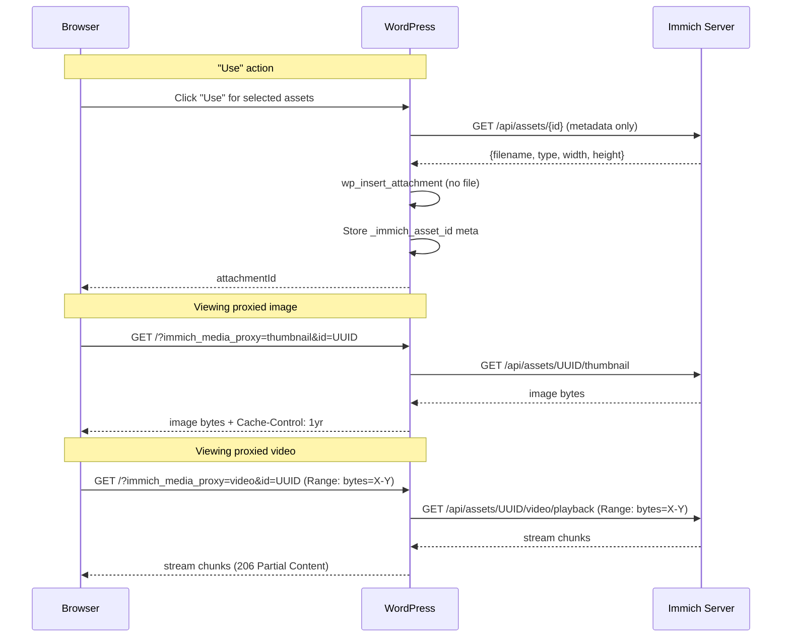

# Proxied Immich Media Design

## Problem

Currently, importing media from Immich downloads the full file into the WordPress media library. This duplicates storage and is slow for large files/videos. Users want to reference Immich assets directly without copying the bytes.

## Solution

Add a "Use" mode alongside the existing "Copy" (full import). "Use" creates a WordPress attachment that proxies its content from Immich on demand. No file is stored locally.

Inspired by [Gallery for Immich](https://github.com/vogon1/immich-wordpress-plugin), which proxies all images through WordPress query parameters.

## Design Decisions

- **Both modes available:** Per-import choice between "Use" (proxy) and "Copy" (full import)
- **Immich-sized thumbnails:** Request appropriate sizes from Immich's thumbnail API rather than serving originals at all sizes
- **Public proxy URLs:** No auth required for viewing — Immich API key stays server-side
- **Browser caching only (initially):** `Cache-Control: public, max-age=31536000`. Endpoint designed so server-side caching can be added later without changing URLs
- **Video streaming:** Chunked streaming via `fopen`/stream context with HTTP Range request support for seeking

## Proxy Endpoint

Hook on `init`, intercept `?immich_media_proxy` query parameter. Public access, no WordPress auth required.

### URL Structure

| Type | URL |
|---|---|
| Thumbnail | `?immich_media_proxy=thumbnail&id=<UUID>` |
| Original | `?immich_media_proxy=original&id=<UUID>` |
| Video | `?immich_media_proxy=video&id=<UUID>` |

### Immich API Mapping

| Proxy type | Immich endpoint | Timeout |
|---|---|---|
| `thumbnail` | `GET /api/assets/{id}/thumbnail` | 10s |
| `original` | `GET /api/assets/{id}/original` | 30s |
| `video` | `GET /api/assets/{id}/video/playback` | 60s |

### Validation

- `type` validated against whitelist: `['thumbnail', 'original', 'video']`
- `id` validated with UUID regex: `/^[0-9a-f]{8}-[0-9a-f]{4}-[0-9a-f]{4}-[0-9a-f]{4}-[0-9a-f]{12}$/`

### Response Headers

- `Content-Type`: forwarded from Immich response (not hardcoded)
- `Cache-Control: public, max-age=31536000`
- `X-Content-Type-Options: nosniff`

### Image Proxying

Use `wp_remote_get()` for thumbnail and original types. Stream body to client.

### Video Streaming

Use `fopen()` with stream context (not `wp_remote_get`, which buffers the entire response):

1. Forward browser's `Range` header to Immich if present
2. Forward Immich's `Content-Range`, `Content-Length`, `Accept-Ranges` headers back
3. Mirror status code (200 full, 206 partial)
4. Read/write in 8KB chunks via `fread`/`echo`/`flush`

## Attachment Storage

When a user clicks "Use", create a WordPress attachment with no local file:

```php
$attachment_id = wp_insert_attachment([
    'post_title'     => $filename,
    'post_mime_type' => $mime_type,
    'post_status'    => 'inherit',
]);

update_post_meta($attachment_id, '_immich_asset_id', $asset_id);
update_post_meta($attachment_id, '_immich_asset_type', $type); // 'IMAGE' or 'VIDEO'
```

Fake attachment metadata so WordPress knows image dimensions and sizes exist:

```php
wp_update_attachment_metadata($attachment_id, [
    'width'  => $original_width,
    'height' => $original_height,
    'file'   => 'immich-proxy/' . $asset_id,
    'sizes'  => [
        'thumbnail' => ['width' => 250, 'height' => 250, 'file' => $asset_id],
        'medium'    => ['width' => 600, 'height' => 600, 'file' => $asset_id],
        'large'     => ['width' => 1024, 'height' => 1024, 'file' => $asset_id],
    ],
]);
```

## URL Generation Hooks

### `wp_get_attachment_url`

For attachments with `_immich_asset_id` meta, return:

```
https://example.com/?immich_media_proxy=original&id=<UUID>
```

### `image_downsize`

For attachments with `_immich_asset_id` meta, return sized proxy URLs:

| WordPress size | Proxy URL |
|---|---|
| `thumbnail` | `?immich_media_proxy=thumbnail&id=<UUID>` |
| `medium` | `?immich_media_proxy=thumbnail&id=<UUID>` |
| `large` | `?immich_media_proxy=thumbnail&id=<UUID>` |
| `full` | `?immich_media_proxy=original&id=<UUID>` |

Both filters pass through to default behavior when `_immich_asset_id` meta is absent (normal attachments unaffected).

## UI Changes

### Button Layout

```
[ Use ]  [ Copy ]
```

- **Use** — creates virtual attachment referencing Immich asset (fast, metadata only)
- **Copy** — existing full import behavior (downloads file)

### Tab Layout

```
.immich-browser
├── .immich-toolbar
│   ├── Search input (.immich-search-input)
│   ├── People dropdown (.immich-people-select)
│   └── [ Use ] [ Copy ]
├── .immich-grid (search results)
├── .immich-used-divider ("Previously added")
└── .immich-used-grid (paginated list of already-used/copied assets)
```

### Previously Added Section

- New AJAX endpoint `immich_proxied_assets` queries `wp_posts` + `wp_postmeta` for attachments with `_immich_asset_id` meta
- Displayed below search results with a divider label "Previously added"
- Own pagination since the list grows indefinitely
- Clicking selects the existing attachment directly (no re-import)
- When search is empty, this section fills the available space

## Data Flow



## Future Considerations

- **Server-side caching:** File-based cache with TTL for proxied images to reduce Immich load
- **Duplicate detection:** Check if asset ID already "used" before creating another attachment
- **Deletion handling:** What happens when an Immich asset is deleted but WordPress still references it
- **srcset support:** Generate `srcset` attributes with multiple Immich thumbnail sizes for responsive images
