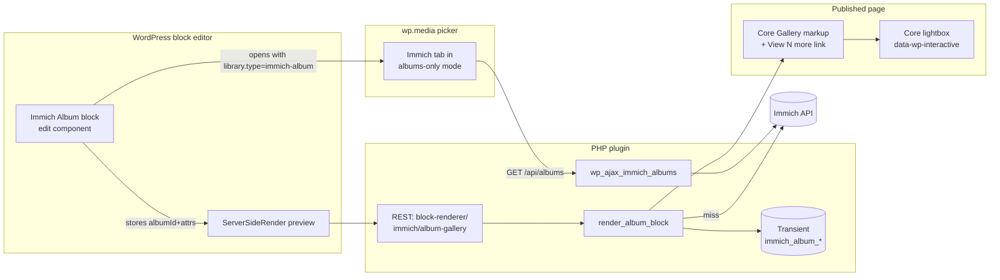

# Immich Album Gallery Block — Design

Resolution of GitHub issue [#7](https://github.com/donnchawp/media-picker-for-immich/issues/7) ("Feature: Enable Albums in WP interface"). The reporter (`@mstewart14`) wants whole-album gallery embeds in posts, citing feature consolidation against the separate [`gallery-for-immich`](https://wordpress.org/plugins/gallery-for-immich/) plugin (less surface, less clutter).

## Scope

In scope:

- A new dynamic Gutenberg block, `immich/album-gallery`, that embeds an Immich album as a live gallery on the published page.
- A block-driven album picker: the block opens the existing `wp.media` Immich tab in an albums-only mode and lets the editor choose an album.
- Server-side rendering that emits **core Gallery markup** (`figure.wp-block-gallery` with `figure.wp-block-image` children) so the gallery inherits theme styles and supports the WP 6.4+ core lightbox.
- Per-block attributes for columns, image size, sort order, limit, lightbox toggle, and captions toggle.
- Hybrid caching of the album asset list (5-minute transient by default) plus a logged-in editor refresh path (`?immich_refresh=1`).
- Hard cap on rendered assets (default 100, filterable) with a "View N more on Immich →" link.

Out of scope:

- Shortcode equivalent (`[immich_album]`). `gallery-for-immich` already covers shortcode use; classic-editor parity is not a goal.
- Snapshot mode (expanding an album into N WP attachments at insert time). Live render only.
- Per-image alt-text or caption overrides stored in WP — fundamentally incompatible with live mode.
- WP-CLI command for cache flushing. Tracked as a possible follow-up.
- Embedding albums via a Featured Image, Image block, or Add-Media flow other than the dedicated block. The Albums-only picker mode only activates when the block opens the picker.

## Current state

- The plugin is a single-file WordPress plugin (`media-picker-for-immich.php`) with a JS picker (`assets/js/media-picker-for-immich.js`) that adds an "Immich" tab to `MediaFrame.Post`, `MediaFrame.Select`, and `MediaFrame.Manage`.
- The Immich tab fetches via authenticated AJAX (`wp_ajax_immich_browse`, `…_search`, `…_people`, `…_used_assets`, etc.) gated by an `immich_nonce` and `upload_files` capability.
- A per-asset image proxy (`?immich_media_proxy=…&id=<uuid>`) serves images on the public frontend using the post-author's API key, with on-disk caching at `wp-content/uploads/immich-cache/<type>/<uuid>`.
- A preview-nonce branch (PR #18) lets logged-in `upload_files` users hit the proxy with `preview_nonce` for assets that aren't yet attached to a post — used by the picker preview overlay and the Cache Files admin page.
- The plugin has **no build step**: PHP + plain JS only. `make release` runs `rsync --exclude-from=.distignore` + `zip`.
- There is no Gutenberg block today.

## Architecture overview



Three distinct flows:

1. **Authoring.** Editor inserts the `immich/album-gallery` block. If `albumId` is empty, a `<Placeholder>` with a "Pick album" button is shown. Click opens `wp.media({ library: { type: 'immich-album' } })`. The Immich tab detects `library.type === 'immich-album'` and renders an Albums-only grid (no People dropdown, no live/cached split, no per-asset Insert button). User picks an album → frame closes, block stores `albumId`. Editor preview is rendered via `<ServerSideRender>` against the auto-registered REST endpoint.
2. **Publishing.** Server-side `render_album_block( $attrs )` reads `albumId`, sort, and limit; consults the transient cache; on miss fetches `/api/albums/{id}` and stores the trimmed asset list under `immich_album_<uuid>_<sort>`. Emits core Gallery markup with proxy URLs for each thumbnail.
3. **Viewing.** Anonymous visitors load the post; the page HTML is whatever WordPress cached. Thumbnails go through the existing public proxy (post-author's API key). Click → core lightbox via `data-wp-interactive`.

### New surfaces

- **PHP**: `ajax_albums` endpoint, `register_block_type` call, `render_album_block` callback, `fetch_album_assets` helper, transient cache helper, error-aware payload.
- **JS**: `assets/js/immich-album-block.js` (block registration, edit component); additions to `assets/js/media-picker-for-immich.js` for albums-only mode and an album-tile renderer.
- **Files**: `includes/block-album-gallery/block.json` and `includes/block-album-gallery/render.php`.
- **CSS**: a small `.immich-album-tile` block in `assets/css/media-picker-for-immich.css`. No frontend CSS — core Gallery styles do that work.

## Section A — PHP

### A.1 Album-list AJAX endpoint

```php
add_action( 'wp_ajax_immich_albums', array( $this, 'ajax_albums' ) );

public function ajax_albums(): void {
    $this->verify_ajax_request();          // nonce + upload_files cap
    $response = $this->api_request( '/api/albums' );
    if ( is_wp_error( $response ) ) {
        wp_send_json_error( array( 'message' => $response->get_error_message() ) );
    }
    $items = array_map( function ( $a ) {
        return array(
            'id'        => $a['id'],
            'name'      => $a['albumName'],
            'count'     => (int) $a['assetCount'],
            'thumbnail' => $this->preview_proxy_url( $a['albumThumbnailAssetId'] ?? '', 'thumbnail' ),
        );
    }, (array) $response );
    wp_send_json_success( array( 'items' => $items ) );
}
```

`preview_proxy_url()` is a **new** helper to be added alongside `handle_proxy_request`. It returns `home_url( '/?immich_media_proxy=thumbnail&id=<uuid>&preview_nonce=<n>' )` for the current user. Reuses the preview-nonce branch from PR #18 so the picker can render album cover thumbs without each cover being attached to a post.

### A.2 Block registration

A new `init` action calls:

```php
register_block_type( __DIR__ . '/includes/block-album-gallery' );
```

`includes/block-album-gallery/block.json`:

```json
{
  "$schema": "https://schemas.wp.org/trunk/block.json",
  "apiVersion": 3,
  "name": "immich/album-gallery",
  "title": "Immich Album Gallery",
  "category": "media",
  "icon": "format-gallery",
  "description": "Embed a live Immich album as a gallery.",
  "textdomain": "media-picker-for-immich",
  "attributes": {
    "albumId":      { "type": "string",  "default": "" },
    "columns":      { "type": "number",  "default": 3 },
    "imageSize":    { "type": "string",  "default": "preview" },
    "sortOrder":    { "type": "string",  "default": "default" },
    "limit":        { "type": "number",  "default": 0 },
    "lightbox":     { "type": "boolean", "default": true },
    "showCaptions": { "type": "boolean", "default": false }
  },
  "supports": {
    "html":  false,
    "align": ["wide", "full"]
  },
  "editorScript": "file:../../assets/js/immich-album-block.js",
  "render":       "file:./render.php"
}
```

`apiVersion: 3`, dynamic block (no `save`), server-rendered. `editorScript: file:` is resolved by core relative to `block.json`, so `../../assets/js/immich-album-block.js` lands at the existing JS asset path.

`render.php` is a thin shim:

```php
<?php
echo Immich_Media_Picker::instance()->render_album_block( $attributes );
```

### A.3 Render callback

`render_album_block( array $attrs ): string` does this work, in order:

1. **Validate `albumId`** against the existing `UUID_PATTERN` regex. Return `''` on invalid (defensive — the editor should never produce one).
2. **Editor refresh probe**: `if ( current_user_can( 'edit_posts' ) && ! empty( $_GET['immich_refresh'] ) ) { $this->flush_album_cache( $album_id ); }`. `flush_album_cache` deletes all four sort-variant transients for that album.
3. **Fetch with cache**:
   ```php
   $sort     = $this->validate_sort( $attrs['sortOrder'] );
   $key      = 'immich_album_' . $album_id . '_' . $sort;
   $cached   = get_transient( $key );
   if ( false !== $cached ) {
       $payload = $cached;
   } else {
       $response = $this->api_request( '/api/albums/' . $album_id );
       if ( is_wp_error( $response ) ) {
           $stale = $this->read_stale_transient( $key );
           if ( false !== $stale ) {
               $payload = $stale;
           } else {
               return $this->render_album_error( $response );
           }
       } else {
           $payload = $this->prepare_album_payload( $response, $sort );
           set_transient( $key, $payload, $this->album_cache_ttl() );
       }
   }
   ```
4. **Apply per-block `limit`** if non-zero. (The hard cap was already applied in `prepare_album_payload`.)
5. **Build core Gallery markup** (see Section A.4).
6. **Append "View N more" link** if `payload['total_count'] > count(rendered_assets)` and `limit` is 0 (i.e., the cap, not the user, did the trimming). The link target is the album's Immich web UI URL: `rtrim( $this->get_api_url(), '/' ) . '/albums/' . rawurlencode( $album_id )`.

`prepare_album_payload( $response, $sort )` — extracts `assets` from the Immich response, applies `$sort` (`default` / `oldest` / `newest` / `random`), trims to the hard cap (default 100, filter `immich_album_max_assets`), and returns:

```php
return array(
    'assets'      => $trimmed,                 // array of {id, originalFileName, fileCreatedAt, type}
    'total_count' => count( $response['assets'] ?? array() ),
    'fetched_at'  => time(),
);
```

`read_stale_transient( $key )` reads `_transient_<key>` directly from `wp_options`, ignoring the timeout sibling — used only on Immich-down to keep the page alive.

### A.4 Core Gallery markup

The goal is to emit the same DOM shape that core's Gallery and Image blocks produce, so theme styles and the WP 6.4+ Interactivity-API lightbox apply with no extra work. The exact attribute set used by core's lightbox shifts between WP versions; the implementation should inspect what `render_block_core_image` emits in the target WP version and mirror it (or, ideally, render each child via `render_block( ['blockName' => 'core/image', 'attrs' => [...]] )` and concatenate, so we ride along with core).

Skeleton, conceptually:

```html
<figure class="wp-block-gallery has-nested-images columns-<N> is-layout-flex wp-block-gallery-is-layout-flex">
  <figure class="wp-block-image size-large">
    " alt="<filename>" loading="lazy" />
    <!-- if showCaptions -->
    <figcaption class="wp-element-caption"><filename></figcaption>
  </figure>
  <!-- ...more children... -->
</figure>
```

`<proxy_url>` is `home_url( '/?immich_media_proxy=' . $size . '&id=' . rawurlencode( $a['id'] ) )` where `$size` is the validated `imageSize` attribute (`thumbnail` / `preview` / `fullsize`).

When `lightbox=true`, the image children carry whatever Interactivity-API markup core's image block currently emits with the lightbox behavior on (likely a `<button class="lightbox-trigger">` and `data-wp-*` directives, but verify against core at implementation time). When `lightbox=false`, emit plain `` with no interactivity attributes.

`<N>` is `max( 1, min( 8, (int) $attrs['columns'] ) )`. `wp_kses_post()` is **not** appropriate — we control the markup. Instead, use `esc_url()` on URLs, `esc_attr()` on attribute values, `esc_html()` on text content. No raw user input is interpolated.

### A.5 REST endpoint for editor preview

WordPress core auto-registers `wp/v2/block-renderer/immich/album-gallery` for any `register_block_type`. Permission default is `edit_posts`. The `<ServerSideRender>` component in the block edit JS will hit it without us registering anything ourselves.

### A.6 Filters

| Filter | Default | Purpose |
|---|---|---|
| `immich_album_cache_ttl` | 300 (5 min) | Transient TTL in seconds. |
| `immich_album_max_assets` | 100 | Hard cap on rendered assets per block. |

No new admin settings — filters cover tuning for power users.

## Section B — JS

### B.1 Block edit component

`assets/js/immich-album-block.js` is a single IIFE that consumes `wp.blocks`, `wp.blockEditor`, `wp.components`, `wp.element`, `wp.serverSideRender`, and `wp.i18n` from globals — no JSX, no build step.

The component:

- Renders a `<Placeholder icon="format-gallery">` with a "Pick album" button when `albumId` is empty.
- Renders `<ServerSideRender block="immich/album-gallery" attributes={attrs} />` when `albumId` is set.
- Always renders `<InspectorControls>` with: a "Pick album" / "Change album" button, `<RangeControl>` for columns, `<SelectControl>` for image size and sort order, `<RangeControl>` for limit, `<ToggleControl>` for lightbox and captions.
- Click on either picker button calls `wp.media({ library: { type: 'immich-album' } })` and listens for a custom event `immich:album-selected` from the frame, which sets `albumId` and closes the frame.

`save: () => null` — dynamic block.

### B.2 Picker integration (additions to `media-picker-for-immich.js`)

The Immich tab `View` already reads `controller.state().get('library').props.get('type')` for the image-vs-video filter (PR #11). Extend it:

- When `type === 'immich-album'`, set `this.isAlbumMode = true`, hide the People dropdown / live grid / cached split, render `_renderAlbumGrid()` instead.
- `_renderAlbumGrid()` POSTs `wp_ajax_immich_albums` with the existing `immich_nonce`, then renders one `<button class="immich-album-tile" data-album-id>` per album with thumbnail, name, count.
- Click on a tile calls `frame.trigger('immich:album-selected', { id, name })`. The block's edit component listens for that event.
- `_immichRequestType()` (PR #15) treats `immich-album` as falsy, so the existing image/video filter forwarding logic is unaffected.
- Empty state: "No albums in this Immich server."
- Error state: same UI as the existing error path on browse failure.

### B.3 CSS

A small block in `assets/css/media-picker-for-immich.css` for the album tiles only. No frontend CSS.

```css
.immich-album-grid { display: grid; grid-template-columns: repeat(auto-fill, minmax(160px, 1fr)); gap: 12px; padding: 12px; }
.immich-album-tile { display: flex; flex-direction: column; gap: 4px; cursor: pointer; background: none; border: 1px solid transparent; }
.immich-album-tile:hover, .immich-album-tile:focus-visible { border-color: var(--wp-admin-theme-color, #2271b1); }
.immich-album-tile img { width: 100%; aspect-ratio: 1 / 1; object-fit: cover; border-radius: 4px; }
.immich-album-tile-name { font-weight: 600; }
.immich-album-tile-count { color: #757575; font-size: 12px; }
```

## Section C — Caching, refresh, error handling

### C.1 Cache layout

- **Album list (per album, per sort)**: `transient: immich_album_<uuid>_<sort>` → `{ assets: [...], total_count: N, fetched_at: ts }`. Default TTL 5 min, filter `immich_album_cache_ttl`. Capped to ~100 entries by `immich_album_max_assets`.
- **Image binaries (thumbnails / previews / fullsize)**: served by the existing on-disk proxy cache at `wp-content/uploads/immich-cache/<type>/<uuid>`. No new mechanism.
- **Sort variants are cached separately** under `(uuid, sort)` keys. Cost is trivial (4× small lists) and keeps the code path identical for every sort. Random sort is non-deterministic per-fetch but stable across the TTL window.

### C.2 Refresh paths

1. **Editor passive**: `?immich_refresh=1` query param plus `current_user_can( 'edit_posts' )` — flushes all four sort-variant transients for the rendered album, then re-fetches.
2. **Cache Files admin page (#19)** — extend with an "Album lists" section listing the active `immich_album_*` transients with album name (resolved via the cache value) and "Refresh / Delete" actions, plus a bulk "Empty all" button. Same nonce + `manage_options` cap pattern as the existing actions on that page.
3. **WP-CLI command** — `wp immich album-cache flush [--id=<uuid>]` is a possible follow-up, not in scope for this spec.

### C.3 Stale-cache fallback

When a cache miss is followed by an Immich error (timeout, 5xx, network), `read_stale_transient()` attempts to recover the previous payload, bypassing the expiry. With the default DB-backed transients it reads `_transient_<key>` directly from `wp_options`. With an external object cache, the underlying option is not present and stale recovery is best-effort — the function returns `false` and the error path runs. This is acceptable: object-cache deployments are sophisticated and an outage there is the operator's problem to monitor.

For editors, render a small "Showing cached version" notice atop the gallery when stale is served. Detect by comparing `fetched_at` against `time() - $ttl`.

### C.4 Visitor-vs-editor matrix

| Scenario | Visitor sees | Editor sees |
|---|---|---|
| Album loaded normally | Gallery | Gallery |
| Cache hit, network fine | Gallery (cached) | Gallery (cached) |
| Cache miss + Immich timeout + stale exists | Gallery (stale) | Gallery (stale) + "showing cached version" notice |
| Cache miss + Immich timeout + no stale | Nothing | Error notice "Could not load Immich album" |
| Album empty | Nothing | Notice "Empty album" |
| Album not found (404) | Nothing | Notice "Album removed from Immich" |
| `albumId` blank or invalid | Nothing | Editor placeholder (Pick album) — never reaches render |

### C.5 Error logging

Errors are logged once per request via `error_log()` with prefix `[media-picker-for-immich]`. No user-facing log spam.

### C.6 Capabilities

- Picker AJAX endpoint: `verify_ajax_request()` → nonce + `upload_files`.
- Block editor: standard WP block-editor caps; the auto-registered block-renderer REST endpoint defaults to `edit_posts`.
- Refresh query param: `current_user_can( 'edit_posts' )`.
- Cache Files admin page entries: `manage_options` (existing).

## Section D — Test plan

No automated test infrastructure exists in the repo. The following is the manual checklist that goes into the PR description, run at `localhost:8888` (admin/password) on wp-env.

### D.1 Pre-flight

- [ ] Settings → Immich has a valid API URL and key.
- [ ] At least three Immich albums on the test server: one normal (~20 assets), one large (>100 assets), one empty.

### D.2 Block authoring

- [ ] Add Immich Album Gallery block in a new post → placeholder with "Pick album".
- [ ] Click "Pick album" → media frame opens, Immich tab is active, Albums grid only (no People dropdown, no live/cached split, no Insert button).
- [ ] Album tiles render with thumbnail + name + asset count.
- [ ] Pick an album → frame closes, block shows ServerSideRender preview.
- [ ] InspectorControls: change columns 1→8 → preview re-renders. Change image size → preview re-renders. Toggle captions → captions appear/disappear. Set limit to 5 → only 5 images. Sort order → order changes.
- [ ] "Change album" button reopens the picker.

### D.3 Editor preview

- [ ] Block edit screen for an album with N>100 assets shows the cap-applied gallery + "View N more on Immich →" link.
- [ ] Empty album → editor shows the "Empty album" notice.
- [ ] Block with `albumId` cleared → falls back to placeholder.

### D.4 Frontend render (anonymous)

- [ ] Save & view post anonymously → core Gallery markup in DOM (`figure.wp-block-gallery`, `figure.wp-block-image` children).
- [ ] Image URLs go through `?immich_media_proxy=` and load.
- [ ] Click an image → core lightbox opens (when WP 6.4+ lightbox is enabled in theme).
- [ ] Toggle `lightbox=false` → no interactivity attributes, plain images.
- [ ] Captions render as `<figcaption>` when `showCaptions=true`.
- [ ] "View N more" link points to `<api_url>/albums/<id>` and opens new tab.
- [ ] Theme styling applies (test on Twenty Twenty-Four + a custom theme if available).

### D.5 Caching

- [ ] First view: Network panel shows one Immich `/api/albums/<id>` call.
- [ ] Reload within 5 minutes: no Immich call (transient hit).
- [ ] Wait 5 min or `wp transient delete --all`, reload: one Immich call.
- [ ] Logged-in editor adds `?immich_refresh=1`: forces re-fetch.
- [ ] `?immich_refresh=1` for an anonymous viewer: ignored (still serves cache).
- [ ] Use the same album in two posts with different `sortOrder` settings: each variant cached separately.

### D.6 Errors

- [ ] Stop Immich (block via `/etc/hosts` or stop the container) with cache populated: page still renders from stale cache; editor sees "showing cached version" notice.
- [ ] Stop Immich with empty cache: anonymous viewer gets nothing; editor sees error notice.
- [ ] Delete the Immich album: anonymous viewer eventually (after TTL) gets nothing; editor sees "Album removed from Immich".
- [ ] Wrong API key: same as Immich-down — fail closed.
- [ ] `albumId` set to a malformed UUID by directly editing block JSON: render returns empty; no fatal.

### D.7 Picker integration regressions

- [ ] Open standard Add Media flow (not via the block) → Immich tab unchanged: People dropdown, live/cached split present, no Albums grid.
- [ ] Open Image block media picker → Immich tab still filters by `IMAGE` only (PR #11/#15 still works).
- [ ] Open Manage frame at upload.php → Immich tab works as before.

### D.8 Permissions

- [ ] Subscriber views a published post with the block → gallery renders (uses post-author's API key via the proxy).
- [ ] Editor without site-wide API key configured but with personal key → block uses their key in the picker AJAX (existing `get_api_key()` semantics).
- [ ] No API key configured anywhere → editor placeholder shows a clear "Configure your API key first" notice; frontend renders nothing.

### D.9 Cleanup

- [ ] Cache Files admin page (when extended) shows active album-list transients and refresh/delete works.
- [ ] Plugin deactivation does not orphan transients (they expire naturally).

## Open follow-ups (out of scope here)

- WP-CLI: `wp immich album-cache flush [--id=<uuid>]`.
- Sort order `random`: cached for the TTL window; some users may want per-pageload random — would need to bypass the cache for that variant only.
- Per-album pre-warm: hit Immich on `save_post` to populate the cache before the first visitor — only worth doing if cold-start latency becomes a real issue.
- Block-pattern starter: a curated "Photo essay" pattern using this block + heading + paragraph blocks.
